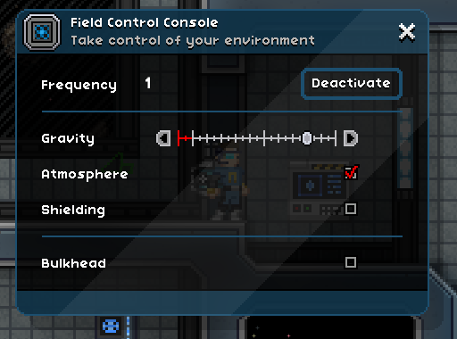
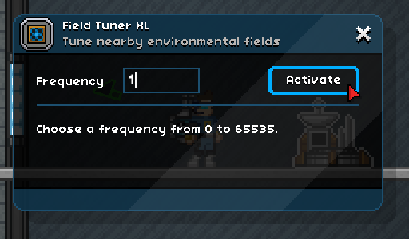

# Field Control Technology User's Guide

Fields determine many of the physical forces of the Starbound universe, such as atmosphere, gravity, and shielding. Field control technology involves two interrelated concepts: field tuning, and field manipulation. Every block within every world is aligned to a field. Using a field tuner, you can re-tune blocks to a different field. Using a field control console, you can manipulate the physical properties of a field, and all of the blocks aligned with it.

In short, this mod allows you to take control of the basic physics of worlds. Some applications include: protecting keypad-locked rooms in your base, protecting bases from meteors, building bases in asteroid belts with air and gravity, and so forth.

Manipulating the physical forces of the universe can be complicated, so please read this guide thoroughly before doing so.

## Field Control Technology: A Primer

This mod provides a number of items for controlling the forces of the Starbound universe:

* Ship Shield Switch and Station Shield Switch
* Field Control Console
* Portable Field Tuner
* Field Tuner XL and Field Tuning Markers

### Ship/Station Shield Switch

A typical starship or space station consists of multiple internal fields. The `ship shield switch` provides a convenient shield control for all of the default fields inside your starship. Likewise, the `station shield switch` provides shield control over the default fields inside your personal space station. These switches control only the default fields in their respective worlds. They do not control additional fields that the user may create, e.g., by using a field control console.

Note that a ship shield switch must be placed on a player's starship. A station shield switch must be placed on a personal space station. Only one of each switch may be placed at a time; if additional switches are placed they will be nonfunctional.

The ship shield switch and station shield switch are crafted at the wiring station, in the mechanics tab.

### Field Control Console

Fields are identified by their field frequency (0-65535). Placing and interacting with a `field control console` allows the player to align the console to a specific field frequency and activate it. The field control console chooses as its default frequency that of the field to which the blocks behind the console are aligned; if that is not a valid frequency, a random frequency is chosen. An alternative field can be chosen by entering its field frequency at the prompt. Activation of a field control console automatically tunes all of the blocks behind the console to the chosen field.

On any given world, many field control consoles may be placed, but only one console can be activated for each field. Furthermore, a field control console cannot be activated when aligned to a field shielded by anything not provided by this mod. For example, it cannot be activated when aligned to the field shielded by a Hylotl underwater shield generator, or to the field shielded by a personal space station's external shields. Additionally, to avoid potentially world-breaking effects, field control consoles cannot be activated when aligned to frequencies above 65519.

Once a valid frequency has been chosen and the field control console activated, the console's interface will enable the manipulation of gravity, atmosphere, and shielding for that field. Atmosphere and shielding are on/off controls. Gravity is controlled by a slider; if set to 0, will result in weightlessness. Gravity may be set to negative values, although this is not recommended as it can be difficult to control and potentially dangerous.

If placed in a world with environmental hazards (i.e., deadly [radiation](https://starbounder.org/Deadly_Radiation), [cold](https://starbounder.org/Deadly_Chill), or [heat](https://starbounder.org/Deadly_Heat)), the field control console will offer an additional setting: environmental protection. Toggling this option on will protect players from those hazards while they are within the field controlled by the console. *This feature requires the mod [Belter Dungeons](https://community.playstarbound.com/resources/belter-dungeons.6357/) (or [No Belter Dungeons](https://community.playstarbound.com/resources/no-belter-dungeons.6358/)) v2.0.0 or later. If neither of those mods is installed, this feature will not be available.*

Deactivation of a field control console will reset the gravity, atmosphere, shielding, and environmental protection for its aligned field to the original values that were present behind the field control console at the moment it was activated. Deactivation is automatic if the field control console is broken.

Field console consoles contain lit electronics and provide a small amount of light. You can activate bulkhead mode to hide the console behind a bulkhead, in which case no lighting is visible.

The field control console is crafted at the wiring station, in the mechanics tab.

### Portable Field Tuner

The main device for tuning blocks to fields is the `portable field tuner`. Portable field tuners allow fine-grained control of the shape of fields, but are limited to about the same range as a fully upgraded matter manipulator.

When you first equip a portable field tuner, it will not be aligned to any field. Right click on a block to align the portable field tuner to the field to which that block is aligned. Under most circumstances, this will activate the field grid, a 5x5 grid showing the fields around the pointer. A green grid square indicates the block behind it is aligned to the same field as the portable field tuner. A blue grid square indicates that the block behind it is aligned to a different field, but is eligible to be re-tuned. A red grid square indicates that the block behind it is shielded, and therefore cannot be re-tuned at this time.

Once the field grid is active, left clicking will begin field tuning, and any blue grid squares will turn green, indicating that the blocks underneath have been re-tuned. If you hold shift, the field grid collapses to a single square, allowing fine-grained tuning of a single block at a time.

Any time you right click on a block, the portable field tuner is re-aligned to the field to which that block is aligned, and the coloration of the field grid will change accordingly. Note, the portable field tuner cannot be aligned to certain fields, in particular, it cannot align to any fields shielded by anything not provided by this mod. For example, it cannot be aligned to the field shielded by a Hylotl underwater shield generator, or to the fields shielded by a space station's external shields. If you right click on a block aligned to such reserved field frequencies, the portable field tuner will produce a warning sound, and the field grid will deactivate.

Field tuning is specific to each world. Any time you travel to another world, the portable field tuner will be reset.

The portable field tuner is crafted at the agricultural station, in the survival tab.

### Field Tuner XL and Field Tuning Markers

The portable field tuner is a tool for fine-grained field tuning. However, manually tuning a large area is tedious. The `field tuner XL` is the larger cousin of the portable field tuner. Place it within an area you wish to tune, and then place `field tuning markers` around it such that they form a rectangle bounding the area you wish to tune. Wire the field tuner XL directly to the field tuning markers; the markers must be wired directly to the field tuner XL or they will not be used.

Interacting with the field tuner XL opens its activation menu. The field tuner XL chooses as its default frequency that of the field to which the blocks behind the field tuner XL are aligned; if that is not a valid frequency, a random frequency is chosen. As an alternative, you may enter any valid frequency; a good choice is the frequency to which one of your field control consoles is aligned. The same rules that apply to the portable field tuner also apply to the field tuner XL; an error message will be generated if the frequency to which it is set is reserved.

Once a valid frequency has been chosen, activating the field tuner XL will begin tuning the blocks within its bounding rectangle. While tuning, the field tuner XL is not interactive and its antenna extends and rotates. The antenna retracts once it has completed tuning. After the field tuner XL has completed tuning, there is no reason to leave it installed in the world. You can take it and the field tuning markers and reuse them elsewhere.

The field tuner XL can tune several thousand blocks per second, and has a two second warmup/cooldown cycle. The maximum length of wiring connections (not in admin mode) produces an upper bound of approximately 36000 tiles within a bounding box, so a very large tuning job can be expected to take approximately ten seconds. Like the portable field tuner, the field tuner XL cannot re-tune shielded blocks; any such blocks encountered during tuning will be ignored.

The field tuner XL and field tuning markers are crafted at the wiring station, in the mechanics tab.

## Caveat: Build-Tune-Shield Loop

One hard-coded aspect of Starbound is that, any time the player places a material tile into a block (e.g., placing a tile using the Matter Manipulator) or adds a matmod to a block (e.g., tilling soil or placing grass seed), Starbound changes the field frequency of that block to 65532. Likewise, any time the player removes a material tile from a block (e.g., break a tile using the Matter Manipulator) or removes a matmod from a block (e.g., removing tilling from soil), Starbound changes the field frequency of that block to 65531. This is hard-coded into the core engine and there is nothing modders can do to prevent it. Note that field frequencies are not changed by adding or removing objects such as furniture or doors, but only by adding or removing material tiles or matmods.

This effect will not affect you as long as you activate shielding on your fields. However, if you disable shielding and add or remove tiles, you must re-tune those tiles afterwards so that they are re-aligned with your desired field. Remember the build-tune-shield loop. Take care, especially when rebuilding areas in zero atmosphere/gravity worlds such as asteroid belts; you may experience sudden loss of atmosphere and/or gravity while rebuilding.

## FAQ

### Q: How is this different from Pilch's Field Generators?

A: Each of Pilch's Field Generators allows you to shield a rectangular-shaped area, and the regions protected by different field generators cannot overlap. If you want to shield a more complex shape, you'd need to set up multiple field generators, potentially many of them. This mod started out as an idea to improve Pilch's Field Generators to allow you to shield any shape. However, Pilch isn't currently active in Starbound, so I built a new mod from scratch. Despite both mods offering similar functionality, the implementations are unrelated, so both mods should play nicely together.

### Q: Isn't field frequency just a fancy way of saying dungeonid?

A: Yes.

### Q: The portable field tuner can only align to field frequencies that already exist in a world. How can I create a new field?

A: You can place a field control console in the world and align it a new field frequency. Once you've activated the console, equip the portable field tuner and right-click the area behind the console to align the tuner to the new frequency.

### Q: Why can't I align the field control console to high field frequencies?

A: Certain field frequencies have special meanings to Starbound. These frequencies exist above 65519. Enabling you to alter these fields could have game-breaking effects. The goal of this mod is to enable the creation and protection of interesting bases and dungeons, not to enable god-level control of worlds. If you want that, there are always admin commands.

### Q: Why can't I re-tune shielded blocks?

A: If you could re-tune shielded blocks, then it would be trivial to unshield any block simply by re-tuning it to a non-shielded frequency. Anyone could destroy your "shielded" base with nothing more than a portable field tuner and a matter manipulator.

### Q: Help, I've locked myself inside a shielded room!

A: That wasn't smart. Time to use admin commands to disable shielding. If you don't have admin privileges, then you'll need to beg someone who does to help you.
